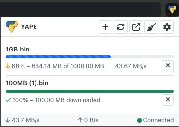

# YAPE - Yet Another PyLoad Extension


YAPE is a Chrome extension for managing downloads in PyLoad, a free and open-source download manager. This extension provides a clean, modern interface to monitor your downloads, add new ones, and manage your PyLoad server directly from your browser.



## Features

- **Real-time Download Monitoring**: Track download progress, speed, and status in real-time
- **Quick Download Addition**: Add URLs with a single click from the popup or right-click context menu
- **Download Management**: Stop, remove, and clear completed downloads
- **Notifications**: Get browser notifications when downloads complete or fail
- **Customizable Settings**: Configure connection details, interface behavior, and notification preferences
- **Speed Limit Control**: Toggle speed limits directly from the extension interface
- **Badge Notifications**: See the number of completed downloads at a glance
- **Direct Web Interface Access**: Open the PyLoad web interface with one click

## Installation

### From Chrome Web Store (coming)

### Manual Installation

1. Download the latest release from the [Releases page](https://github.com/username/yape/releases)
2. Extract the ZIP file
3. Open Chrome and navigate to `chrome://extensions/`
4. Enable "Developer mode" (toggle in the top-right corner)
5. Click "Load unpacked" and select the extracted folder
6. The extension should now appear in your Chrome toolbar

## Getting Started

1. Click the YAPE icon in your browser toolbar
2. Go to Settings by clicking the gear icon
3. Enter your PyLoad server details (hostname, port, username, password)
4. Click "Test Connection" to verify everything is working correctly
5. Start managing your downloads!

## Usage

### Adding Downloads

- **From the popup**: Click the "+" icon, enter a URL, and click "Add"
- **From the context menu**: Right-click on any link and select "Download with PyLoad"

### Managing Downloads

- **Remove a download**: Click the "X" icon next to any download
- **Clear completed downloads**: Click the broom icon in the header
- **Toggle speed limit**: Click the speed limit icon in the header

### Customization

Navigate to Settings to customize:

- **Interface Settings**: Control auto-refresh, show/hide completed downloads, and more
- **Notification Settings**: Choose which notifications you want to receive
- **Connection Settings**: Configure your PyLoad server connection details

## Development

### Prerequisites

- Node.js (v14+)
- npm (v6+)

### Setup

```bash
# Clone the repository
git clone https://github.com/username/yape.git
cd yape

# Install dependencies
npm install

# Build for development
npm run dev

# Build for production
npm run build
```

### Project Structure

```
/src
├── background/        # Background script
├── common/            # Shared code
│   ├── api/           # PyLoad API client
│   ├── components/    # Shared React components
│   ├── state/         # State management
│   ├── styles/        # SCSS styles
│   └── utils/         # Utility functions
├── popup/             # Popup UI
│   ├── components/    # Popup-specific components
│   └── hooks/         # Custom React hooks
└── settings/          # Settings UI
```

## Migrating from v1

YAPE v2 is a complete rewrite of the original extension, with many improvements and new features. If you're upgrading from v1:

1. Uninstall the old version
2. Install the new version
3. Reconfigure your server settings

Your existing downloads will continue to be managed by PyLoad, and the new extension will display them.

## Contributing

Contributions are welcome! Please feel free to submit a Pull Request.

1. Fork the repository
2. Create your feature branch (`git checkout -b feature/amazing-feature`)
3. Commit your changes (`git commit -m 'Add some amazing feature'`)
4. Push to the branch (`git push origin feature/amazing-feature`)
5. Open a Pull Request

## License

This project is licensed under the MIT License - see the [LICENSE](LICENSE) file for details.

## Acknowledgments

- [PyLoad](https://pyload.net/) - The awesome download manager that makes this extension possible
- [Original YAPE Extension](https://github.com/RemiRigal/Yape) - For the inspiration
