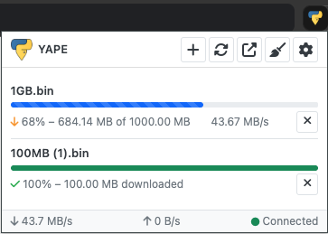

# YAPE v2 - Yet Another PyLoad Extension


> **A modern rewrite of the original [YAPE extension](https://github.com/RemiRigal/Yape)** - rebuilt from the ground up with React, TypeScript, and Chrome Manifest V3.

YAPE v2 is a Chrome extension for managing downloads in [PyLoad](https://pyload.net/), a free and open-source download manager. This extension provides a clean, modern interface to monitor your downloads, add new ones, and manage your PyLoad server directly from your browser.



## What's New in v2

This is a **complete rewrite** of the original YAPE extension, featuring:

- 🔧 **Modern Tech Stack**: React 18, TypeScript, Webpack, SCSS
- 🛡️ **Manifest V3**: Built on Chrome's latest extension platform for better security and performance
- 🎨 **Redesigned UI**: Clean, responsive interface with Bootstrap 5
- ⚙️ **Dedicated Settings Page**: Full configuration panel with connection testing
- 🔔 **Enhanced Notifications**: Configurable alerts with sound support
- 📊 **Smart Badge System**: Persistent download count tracking

## Features

- **Real-time Download Monitoring**: Track download progress, speed, and status with live updates
- **Quick Download Addition**: Add URLs from the popup or right-click context menu
- **Advanced Download Options**: Support for custom paths, FTP credentials, and unzip passwords
- **Download Management**: Pause, resume, remove, and clear completed downloads
- **Smart Notifications**: Configurable browser notifications for added, completed, and failed downloads
- **Customizable Settings**: Configure connection details, auto-refresh intervals, and notification preferences
- **Speed Limit Control**: Toggle speed limits directly from the extension interface
- **Badge Notifications**: See the number of completed downloads at a glance (persists across browser restarts)
- **Connection Testing**: Verify your PyLoad server connection with one click
- **Direct Web Interface Access**: Open the PyLoad web interface instantly

## Installation

### From Chrome Web Store (coming)

### Manual Installation

1. Download the latest release from the [Releases page](https://github.com/8bitgentleman/Yape/releases)
2. Extract the ZIP file
3. Open Chrome and navigate to `chrome://extensions/`
4. Enable "Developer mode" (toggle in the top-right corner)
5. Click "Load unpacked" and select the extracted folder
6. The extension should now appear in your Chrome toolbar

## Getting Started

1. Click the YAPE icon in your browser toolbar
2. Go to Settings by clicking the gear icon
3. Enter your PyLoad server details (hostname, port, username, password)
4. Click "Test Connection" to verify everything is working correctly
5. Start managing your downloads!

## Usage

### Adding Downloads

- **From the popup**: Click the "+" icon, enter a URL, and click "Add"
- **From the context menu**: Right-click on any link and select "Download with PyLoad"

### Managing Downloads

- **Remove a download**: Click the "X" icon next to any download
- **Clear completed downloads**: Click the broom icon in the header
- **Toggle speed limit**: Click the speed limit icon in the header

### Customization

Navigate to Settings to customize:

- **Interface Settings**: Control auto-refresh, show/hide completed downloads, and more
- **Notification Settings**: Choose which notifications you want to receive
- **Connection Settings**: Configure your PyLoad server connection details

## Development

### Prerequisites

- Node.js (v14+)
- npm (v6+)

### Setup

```bash
# Clone the repository
git clone https://github.com/8bitgentleman/Yape.git
cd Yape

# Install dependencies
npm install

# Build for development
npm run dev

# Build for production
npm run build
```

### Project Structure

```
/src
├── background/        # Service worker (Manifest V3)
├── common/            # Shared code
│   ├── api/           # Modular PyLoad API client
│   │   ├── modules/   # Auth, Downloads, Queue, Config clients
│   │   └── client.ts  # Main API entry point
│   ├── components/    # Shared React components
│   ├── state/         # Chrome storage state management
│   ├── styles/        # SCSS styles (Bootstrap customization)
│   └── utils/         # Utility functions (formatting, etc.)
├── popup/             # Popup UI
│   ├── components/    # Download list, forms, status bar
│   └── hooks/         # useDownloadManager, downloadActions
└── settings/          # Settings page UI
    └── components/    # Connection, interface, notification forms
```

### Tech Stack

- **Frontend**: React 18, TypeScript, Bootstrap 5, Font Awesome
- **Build**: Webpack 5, SCSS, ts-loader
- **Extension**: Chrome Manifest V3, Chrome Storage API
- **Testing**: Jest

## Migrating from the Original YAPE

If you're coming from [RemiRigal's original YAPE extension](https://github.com/RemiRigal/Yape):

1. Uninstall the original extension
2. Install YAPE v2
3. Reconfigure your PyLoad server settings (the new settings page makes this easy!)

Your existing downloads in PyLoad will continue running - the new extension will pick them up automatically.

## Contributing

Contributions are welcome! Please feel free to submit a Pull Request.

1. Fork the repository
2. Create your feature branch (`git checkout -b feature/amazing-feature`)
3. Commit your changes (`git commit -m 'Add some amazing feature'`)
4. Push to the branch (`git push origin feature/amazing-feature`)
5. Open a Pull Request

## License

This project is licensed under the MIT License - see the [LICENSE](LICENSE) file for details.

## Acknowledgments

- [PyLoad](https://pyload.net/) - The awesome download manager that makes this extension possible
- [RemiRigal/Yape](https://github.com/RemiRigal/Yape) - The original YAPE extension that inspired this rewrite. This project is a fork that has been rebuilt from scratch with a modern tech stack while maintaining the original spirit of simplicity
